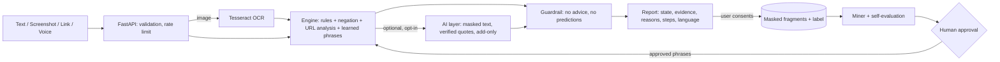

# ScamShield Bharat

**Before you trust it, check it.** An investor-safety assistant for SANGYAN Track A (Digital Fraud & Scam Resilience). Paste a suspicious investment message, upload a screenshot, check a link or speak it. ScamShield highlights the exact phrases that look like scam tactics, explains why each matters in **English, Hindi or Tamil**, states its uncertainty, gives safe next steps, and **learns from users who choose to help** (opt-in, masked, human-approved). It never gives investment advice.

**Detect → Explain → Verify → Protect.**

## What is verified and what is not
| Verified here | Not verified / not built |
|---|---|
| 57 backend tests and 31 browser-flow checks pass (simulated browser against live servers, no JavaScript errors) | Real-microphone voice recognition (the flow is simulated; try it in Chrome or Edge) |
| Screenshot OCR with real Tesseract: English, Hindi and Tamil test images read at 95-96% confidence | The AI layer against the live Anthropic API (tested against a local mock of its wire format; needs your key) |
| Learning loop end to end: consent, masking, mining, human approval, similarity, self-evaluation, deletion, retention | Hindi and Tamil wording has not been reviewed by native speakers |
| Every page, asset, header and the 404 checked on a live server; gzip, robots, sitemap, internal links | The service worker, the install prompt and the content-security policy in a real browser (pages are tested for compatibility, but no real browser was available) |
| Output guardrail, validation, rate limit, friendly errors, prompt-injection tests for the AI layer | Next.js port (not done on purpose: a rewrite adds risk before a demo; the UI is one static page served by FastAPI) |
| Link analysis never opens the site (no SSRF surface) | Redirect tracing, Docker, a database server (learning uses one local SQLite file) |

## Quick start
**Easiest on Windows:** double-click `run.bat` (needs Python 3 from python.org), then open http://localhost:8000. It sets everything up the first time.

**Manual (PowerShell):**
```powershell
cd scamshield-bharat\backend
python -m venv .venv
.venv\Scripts\activate
pip install -r requirements.txt
python -m uvicorn app.main:app --reload
```
Open **http://localhost:8000**. Tests: `python -m pytest -q`. API docs: http://localhost:8000/api/docs.

**Screenshot reading (OCR)** needs the Tesseract program. Install it (Windows: the UB Mannheim installer, tick the Hindi and Tamil data), check `tesseract --list-langs` in a new terminal, restart the server. If Hindi or Tamil data is missing the report says so (`ocr_missing`) instead of silently reading only English. Without Tesseract everything else works.

## What is in the folder
```
run.bat, START-HERE.txt      double-click to start (Windows)
README.md, .env.example      documentation and settings
backend/
  requirements.txt           Python packages
  app/                       engine.py, learn.py, llm.py, locales.py, pages.py, main.py
  app/static/                index.html (the website), service worker, manifest, icons
  tests/                     57 backend tests + e2e/browser_flow.js
```
It is about 100 KB on purpose: the hackathon rewards low-bandwidth usability. Everything is in `backend/`.

## Two-minute tour
1. **Analyze Message** → "Guaranteed return": phrases are marked, a gauge and a pattern radar show the result, findings list evidence and reasons. Hover a finding to light up its phrase.
2. Change **Explain in** to தமிழ் or हिन्दी. If the message is in another language than the report, a button offers to switch.
3. "Ordinary information" stays at **LOW APPARENT RISK**: "not guaranteed" and "never share your OTP" are recognised as safe wording.
4. **Check Link** → `https://nseindla.com/login`: the address is drawn in parts and the wrong letters are underlined against `nseindia.com`.
5. **Upload Screenshot** (drop a file): scan line, extracted text and OCR confidence. **Use Voice** (Chrome/Edge): mic with live waveform and transcript. **Listen** reads results aloud; **Copy family alert**; **Save as PDF**.
6. Under a result, **Help ScamShield learn**: tick consent, say whether it was a scam, see exactly which fragments were shared, and delete them. Scroll to **How ScamShield learns** for the live numbers.

## Architecture

Files: `app/engine.py` (rules, URL checks, OCR, guardrail), `app/learn.py` (learning loop), `app/llm.py` (optional AI layer), `app/locales.py` (all report text), `app/main.py` (API, security headers, site routes), `app/pages.py` (About, Privacy, Terms, Help & FAQ, Offline, 404), `app/static/` (UI, service worker, manifest, icons), `tests/`.

## Website features
- **Pages:** the checker, How it works, Help & FAQ (what to do if you were scammed, official places to verify and report), Privacy, Terms, an offline page and a real 404. Shared header, footer and skip link.
- **Installable:** web app manifest, PNG and SVG icons, and a service worker (network-first, so pages and assets open offline; analysis still needs the server; the API is never intercepted or cached).
- **Search and sharing:** titles, descriptions, Open Graph tags, `robots.txt` and `sitemap.xml` (built from the address it is served on).
- **Security:** content-security policy (same-origin connections only, no external scripts), `X-Frame-Options`, `nosniff`, `Referrer-Policy`, `Permissions-Policy`. A test fails if any page gains an external script or an inline event handler.
- **Accessibility and speed:** landmarks, focus styles, reduced-motion support, print stylesheet, `noscript` notice, gzip (home page 38.9 KB, 13.5 KB on the wire). No framework and no third-party requests. The whole app is small on purpose: low-bandwidth usability is an explicit SANGYAN criterion.

**Before publishing:** serve over HTTPS (browsers allow the microphone and service workers only on HTTPS or localhost); add your team's contact to `/privacy` and have `/privacy` and `/terms` reviewed (they are plain-language drafts, not legal advice); set `ADMIN_TOKEN` and decide who reviews learned phrases; verify the official links and helpline; have the Hindi and Tamil wording reviewed; the rate limiter is in-memory per process, so put a proxy in front for real traffic.

## Assessment logic
Weights: OTP/PIN request 5; payment, guaranteed or unrealistic returns 3; urgency, scarcity, impersonation, fear, community pattern 2; link issues add 2-5 (lookalike 5, `@` trick 5, brand abuse 4, bare IP 4, shortener / no HTTPS / odd ending 2). Total ≥ 5 → **HIGH-RISK INDICATORS DETECTED**, 1-4 → **NEEDS VERIFICATION**, 0 → **LOW APPARENT RISK**. Negated phrases are skipped in English; Hindi and Tamil OTP-request rules skip negative forms. Users never see a number and nothing is called "definitely a scam".

## How ScamShield learns
Nothing is learned from anyone who does not opt in. When a user ticks consent and labels a result (scam / not a scam / not sure):
1. **Mask:** only 2-3 word fragments are kept. Digits become `#`; links, emails and UPI IDs are dropped. The full message is never stored; the user is shown exactly what was kept and can delete it (also via "Delete all history and my shared fragments"). Contributions expire after 90 days (`LEARN_RETENTION_DAYS`).
2. **Mine:** fragments that appear in at least 3 scam reports (`LEARN_MIN_SUPPORT`), rarely in not-scam reports, and are not already covered by the rules become candidates; overlapping fragments are merged and scams the engine missed are ranked first.
3. **Approve:** a human reviewer approves or rejects each phrase (`python -m app.learn candidates`, then `approve "<phrase>"` / `reject "<phrase>"`, or the token-protected `/api/admin/*` endpoints with `ADMIN_TOKEN`). Only approved phrases change results, and they appear as "Matches patterns reported by other users" with the exact words marked.
4. **Remember:** wording that is nearly identical to 3 or more scam reports raises a moderate signal automatically (never above "Needs verification" on its own).
5. **Measure:** the engine compares its own prediction at submission time with the user's label and shows recall, precision and missed scams on the public panel.

Limits: labels come from users and can be wrong or malicious, which is why the threshold, the human approval and the add-only weight exist. Fragments can contain a name that appears once; such fragments stay hidden because they never reach the support threshold, and they expire. Treat the stored data as sensitive anyway.

## Optional AI layer (off by default)
Set `ANTHROPIC_API_KEY` (and optionally `LLM_MODEL`). The UI then shows an opt-in box "Add an AI explanation". Only if it is ticked, the text is sent with numbers and IDs masked. The AI may add findings only when its quote appears verbatim in the user's text, can never lower a risk state, and its summary is dropped if it calls anything safe or genuine and replaced if it gives advice. If it fails, the rule-based result is returned with a note.

## API
| Endpoint | Notes |
|---|---|
| `POST /api/analyze/text` `{text, lang, use_llm?}` | up to 5000 characters |
| `POST /api/analyze/url` `{url, lang}` | analysed as text, the site is never opened |
| `POST /api/analyze/image` multipart `file`, `lang`, `use_llm?` | PNG/JPEG/WebP ≤ 5 MB; adds `ocr_text`, `ocr_confidence`, `ocr_languages`, `ocr_missing` |
| `POST /api/contribute` `{text, lang, label, consent:true}` / `DELETE /api/contribute/{token}` | masked fragments only; returns what was kept |
| `GET /api/learning`, `/api/indicators?lang=`, `/api/stats`, `/api/demo-cases`, `/api/health` | `learning` is public and aggregate only |
| `GET /api/admin/candidates`, `POST /api/admin/decide` | require header `X-Admin-Token`; locked unless `ADMIN_TOKEN` is set |

Reports contain `state` (`LOW|VERIFY|HIGH`), `state_label`, `summary`, `findings[]` (`id`, `title`, `why`, `evidence[]`, `source`), `links[]`, `steps[]`, `disclaimer`, `detected_language`, `mode` (`rules` or `rules+llm`). Errors are `{"detail": "<plain-language message>"}`.

## Privacy and security
Analysis is stateless: content is processed in memory, not written or logged. The only stored user-derived data is the opt-in fragments above, plus anonymous counters. History in the page is saved in the browser only, holds no message text, and can be deleted. Voice input uses the browser's speech service (Chrome and Edge send audio to their servers); the page says so. Controls: Pydantic validation, size limits, magic-byte file check, decompression-bomb limit, per-IP rate limit (in-memory, single process), no URL fetching, no shell execution, secrets only in environment variables, generic error messages, HTML-escaped output.

## Guardrails and limitations
Every outgoing explanation passes a filter that replaces anything reading as a buy/sell/hold call or a price/return prediction (tests cover all text in all three languages). The engine is rule-based plus approved learned phrases: it misses reworded or image-only scams and can flag unusual but legitimate messages. The official-domain list is short. Verify cybercrime.gov.in and helpline 1930 before presenting.

## SANGYAN evaluation mapping
| Criterion | Where |
|---|---|
| Investor resilience & safety | Evidence-based explanations, safe next steps, link triage, community patterns |
| Bharat-first usability | EN/HI/TA output, mobile-first, voice in/out, screenshots, works in a phone browser |
| Trust, privacy, guardrails | Stateless analysis, opt-in learning with deletion, human approval, uncertainty wording, output guardrail |
| Technical execution | Rules + OCR + URL analysis + optional AI + learning loop, 57 tests, 31 browser-flow checks |
| Impact & scalability | Languages are data (`locales.py`), indicators are a table, learning turns user reports into new coverage |

## Re-running the checks
```powershell
cd backend ; python -m pytest -q
# browser-flow check against a running server (needs Node.js): 
cd tests\e2e ; npm i jsdom ; $env:BASE="http://127.0.0.1:8000/" ; node browser_flow.js
```
